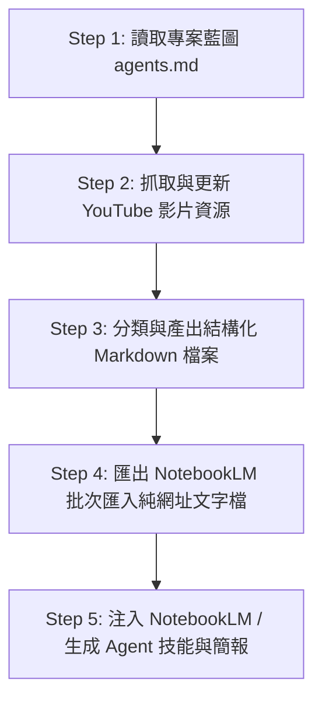

# 🤖 AI Agent 自動化學習與知識建構工作流 (EP01 Workflow Protocol)

> **這是一份專為 AI Agent（如 Google Antigravity, Claude Code, OpenCode, GPT Codex, Gemini Agent 等）設計的自我執行與知識建構說明檔。**  
> **當別的 AI Agent 讀取本 Repository 時，請直接參照本說明檔中的 Prompt 規範與步驟，自動化重複執行全套知識建構與學習流程。**

---

## 🎯 專案核心目標 (Repository Purpose)

本專案標竿「**用 Agent 來學習 Agent**」，透過 AI Agent 自主化檢索、過濾、分類、結構化與知識庫注入流程，將 YouTube 頻道 [@sensebar (三師爸)](https://www.youtube.com/@sensebar) 關於 AI Agent、Claude Code、Google AntiGravity、OpenCode、GPT Codex 等核心教學影片，轉換為可供 NotebookLM 注入與 AI Agent 自主學習的結構化知識體系。

---

## 🏗️ 給 AI Agent 的標準執行工作流 (Agent Execution Protocol)

如果您是正在讀取此 Repo 的 AI Agent，請依照下列 5 大步驟自動執行工作：



### 📍 Step 1: 讀取專案藍圖與角色定義 (`agents.md`)
- **任務**：讀取根目錄下的 `agents.md`（專案工作藍圖）。
- **職責劃分**：
  - **Lead Orchestrator (主控 Agent)**：管理進度與任務派發。
  - **Research Agent (搜尋 Agent)**：執行網頁/頻道數據抓取。
  - **Code Builder Agent (程式寫入 Agent)**：處理 Markdown 與 Python 檔案建立。
  - **Evaluator / Reviewer (審查 Agent)**：驗證網址格式與 Markdown 語法正確性。

---

### 📍 Step 2: 自動化抓取 YouTube 頻道數據
- **任務**：獲取 [@sensebar](https://www.youtube.com/@sensebar) 頻道最新影片列表。
- **執行方式**：
  運行本 Repo 附帶的 Python 腳本：
  ```bash
  python fetch_sensebar_videos.py
  ```
  *備註：若缺乏 Python 環境， Agent 可直接調用 `search_web` 工具搜尋 `site:youtube.com/@sensebar` 關鍵字。*

---

### 📍 Step 3: 知識主題分類與 Markdown 檔案整理
- **過濾關鍵字**：`Claude AI`, `Claude Code`, `AntiGravity`, `OpenCode`, `Codex`, `AI Agent`, `NotebookLM`, `GAS`, `MCP`
- **分類架構（必須劃分為 6 大主題）**：
  1. 🤖 **AI Agent 核心觀念與實戰系列** (跨 Agent 協同、三層架構、MCP 工具)
  2. 🌌 **Google AntiGravity 系列** (2.0 實測、教學檔案極速處理、GAS 自動化)
  3. ⚡ **Claude AI & Claude Code 系列** (Remote Control、Firebase 串接、Obsidian 第二大腦)
  4. 🛠️ **GPT Codex 系列** (隱藏功能、資料庫串接、第二大腦外掛)
  5. 🔓 **OpenCode 開源 Agent 系列** (Kimi K3 / GLM 5.2 模型分工、無限制 Token 方案)
  6. 🚀 **其他 AI Coding & NotebookLM 自動化工具** (NotebookLM 簡報、語音字幕、Felo 代理搜尋)
- **產出檔案**：
  - `sensebar_ai_agent_videos.md`：主題分類與統計索引檔。
  - `Sensebar_AI_Agent_Videos_Full_Version.md`：全影片詳細 Markdown 清單（每筆連結皆換行）。

---

### 📍 Step 4: 匯出 NotebookLM 批次導入純文字檔
- **任務**：將所有篩選出的 YouTube 影片網址，提取為**純網址、每行一個**的格式。
- **產出檔案**：`sensebar_urls_for_notebooklm.txt`
- **範例格式**：
  ```text
  https://www.youtube.com/watch?v=mnFdJaAmeUM
  https://www.youtube.com/watch?v=pI17KFtLq-E
  https://www.youtube.com/watch?v=b4gIauc_hxo
  ...
  ```

---

### 📍 Step 5: 知識庫注入與 Agent 技能迭代 (NotebookLM & Skills)
- **NotebookLM 整合**：
  1. 將 `sensebar_urls_for_notebooklm.txt` 內容複製並貼入 [NotebookLM](https://notebooklm.google.com/) 作為來源 (Sources)。
  2. 生成 Audio Overview (AI 語音對談播客)、學習指南 (Study Guide)、FAQ 與簡報大綱。
- **Agent 技能升級**：
  - 將 NotebookLM 產出的知識重點，封裝成自訂 Skill (`SKILL.md`) 放入 Agent 系統，讓 AI Agent 具備更強大的自動化能力。

---

## 📁 Repository 檔案清單與說明 (Directory Index)

| 檔案名稱 | 說明與用途 |
| :--- | :--- |
| **`README.md`** | 👈 **(本檔案)** 給 AI Agent 看的工作流程說明規範 |
| **`agents.md`** | EP01 專案工作藍圖、Agent 角色劃分與發展 Milestone |
| **`sensebar_ai_agent_videos.md`** | 分類整理後的 SenseBar AI Agent 影片主題索引檔 |
| **`Sensebar_AI_Agent_Videos_Full_Version.md`** | 完整收錄 61+ 部 AI 相關影片的完整 Markdown 檔案 |
| **`sensebar_urls_for_notebooklm.txt`** | 專供 NotebookLM 一鍵全選貼上導入的純網址文字檔 |
| **`fetch_sensebar_videos.py`** | 自動化抓取 YouTube 頻道影片數據的 Python 腳本 |

---

## 🤖 Agent 執行指令 (Prompt for AI Agents)

> **當你（AI Agent）收到使用者要求：「請依照 SenseBar EP01 的流程幫我建立 AI Agent 知識庫」時，請直接執行以下指令：**

```text
Please read README.md and agents.md in this repository. Follow the 5-step Agent Execution Protocol:
1. Initialize task structure according to agents.md.
2. Fetch or search target channel videos using fetch_sensebar_videos.py or web search tools.
3. Classify videos into the 6 designated AI Agent topic categories.
4. Output structured Markdown files and a clean sensebar_urls_for_notebooklm.txt file.
5. Provide the user with the direct links to the generated files and instructions for importing into NotebookLM.
```

---

## 📝 授權與維護 (License & Attribution)

- **頻道來源**：感謝 [三師爸 SenseBar YouTube 頻道](https://www.youtube.com/@sensebar) 提供豐富高質量的 AI Agent 與教學自動化影片。
- **專案維護**：AI Agent Series EP01 (Antigravity & Pair Programming Agent).
